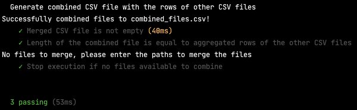

# csv-combo
CSV file combinator for CLI using node.js.

## Getting Started

Clone this repository and navigate to directory in your local machine using the CLI.

### Install

Command to run in root directory to install application is:

`npm i`

## Inputs

CSV files' pathname (containing the same columns) as arguments.

## Outputs

New CSV file with all the rows from inputs, and adding a new column with a header "Filename" with the CSV filename.

If no filename provided for final file, the default filename applied is `combined_files.csv`.

## Run

Command to run:

`node csv_combo /n1 /n2 /n3 # filename.csv`

`n` being the pathnames of all files to combine, and `filename` the name for the new CSV combined file (output).

Example:

`node csv_combo ./file.csv ./file2.csv # newFile.csv`

## Test

Command to run:

`mocha`

